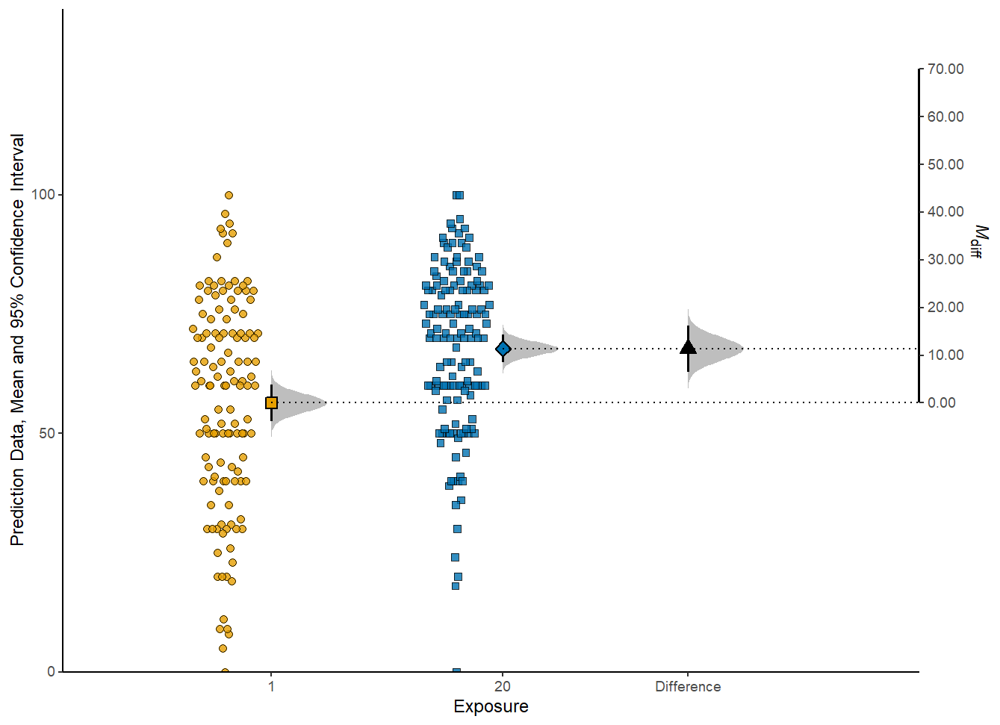

# esci 

esci provides student-friendly tools for estimation statistics:

- effect sizes with confidence intervals for many research designs
- meta-analysis
- visualizations emphasizing effect sizes and uncertainty
- strong hypothesis testing with interval nulls


esci is both an R package and a module in [jamovi](https://www.jamovi.org/).  If
you're looking for the R package, stay here.  If you want esci in jamovi,
download and install jamovi and 
[then use the module library to add esci](https://thenewstatistics.com/itns/esci/jesci/).


Leave comments, bug reports, suggestions, and questions about esci 
[here](https://github.com/rcalinjageman/esci/discussions)


**esci is still under development; expect breaking changes in the future
especially for the visualization functions**.  If you need production-ready
estimation, turn to [statpsych](https://dgbonett.github.io/statpsych/)


esci is built on top of [statpsych](https://dgbonett.github.io/statpsych/) and
[metafor](https://www.metafor-project.org/doku.php/metafor).  That is, almost 
all of the statistical calculations are passed off to these packages.  The 
only exception is for confidence intervals for Cohen's d (see documentation).
Why does esci exist, then?

- To provide a design-based approach; each function in esci is for one type of
research design (e.g. two groups with a continuous variable); it provides
all the effect sizes relevant to that design in one convenient function (e.g.
mean difference, cohen's d, median difference, ratio of means, ratio of
medians).  
- To make visualzation easier; esci provides visualizations that emphasize
effect sizes and uncertainty
- To integrate with GUIs for students; esci integrates into [jamovi](https://www.jamovi.org/)
and integration into [JASP](https://jasp-stats.org/) is planned.

The visualiations produced by esci are exquisite in a large part because of
the lovely [ggdist](https://cran.r-project.org/web/packages/ggdist/index.html) 
package by Matthew Kay.


## Installation

esci is not (yet?) on CRAN so install from github:

``` r
# install.packages("devtools")
devtools::install_github('rcalinjageman/esci')
```


## Roadmap
- Finish writing documentation and tests
- Review all functions for consistency of parameter names and returned object
names
- Rewrite visualization functions completely to remove clunky approaches
to the difference axis and other issues
- Complete JASP integration
- Rewrite jamovi integration
- Add prediction intervals for basic designs
- Repeated measures with 1 IV and multiple groups
- Fully within-subjects 2x2 design
- Arbitrarily complex designs


## Example
``` r
library(esci)

data("data_penlaptop1")
estimate <- estimate_mdiff_two(data_penlaptop1, transcription, condition)
plot_mdiff(estimate)

```


